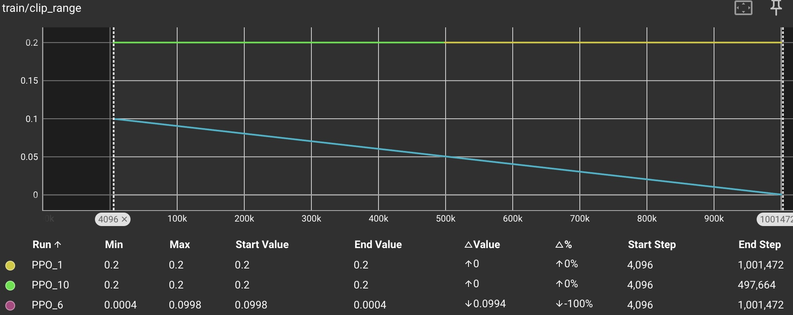
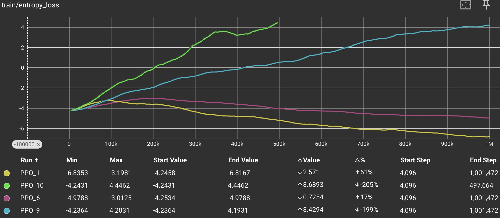
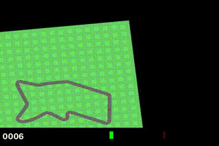
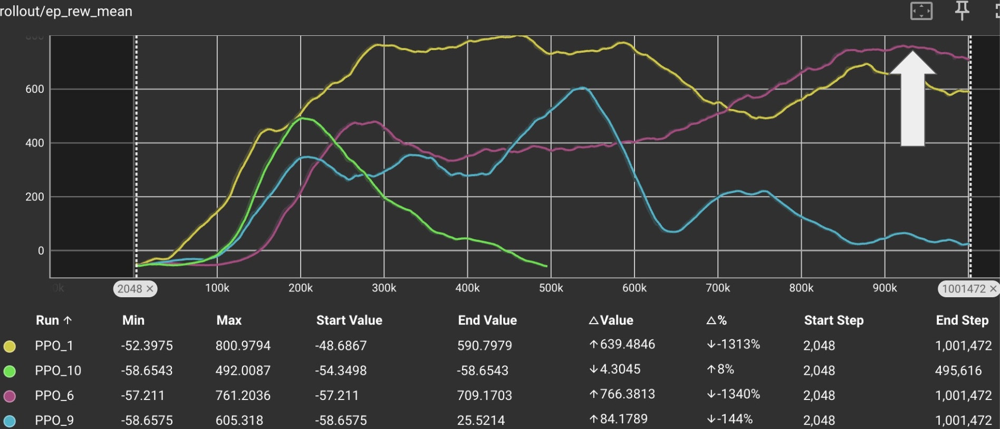

# Self-Driving Car Reinforcement Learning
This project uses reinforcement learning (RL) in the OpenAI Gymnasium Car Racing Environment to teach the car how to drive on the track.

  
  
  
  

## Models

Four models were trained using stable baselines Proximal Policy Optimization (PPO) and adjusting the hyperparameters in search of the best outcome.

## HyperParameters

Changes:

### Learning Rate
I changed the learning rate from the default twice in the code, however TensorBoard showed an unchanged rate. No errors were thrown, so not sure what the issue was. Unfortunate because this is a main parameter and should have given me more control over the training.

### Clip Range
Controls the clipping of the policy probability ratios during the training process. This clipping is crucial for ensuring stable and reliable updates to the policy, preventing overly large updates that could destabilize training.
-   A smaller `clip_range` results in more conservative updates, potentially slowing down training but increasing stability. A larger `clip_range` allows for more significant updates but can risk instability.

I used the default and a formula which decreases the `clip_range` over time, linearly.

Result:

### Batch Size
Determines how many experiences (combinations of state, action, reward, etc.) are used in a single forward and backward pass of the neural network.

Tried 32, 64 and 128.

### Epoch
The number of epochs determines how many times this batch is reused for updating the networks.

I used 10 and 20 for these parameters.

Passes before policy update:
 - v1: 10 x 64 = 640
 - v2: 10 x 64 = 640
 - v3: 20 x 128 =2560
 - v4: 10 x 32 = 320

### Validation Function Coefficient
In PPO, the combined loss function typically has three main components:

1.  **Policy Loss**: Encourages the policy to improve the expected return.

2.  **Value Function Loss**: Ensures the value function accurately predicts the expected returns.

3.  **Entropy Bonus**: Encourages exploration by penalizing deterministic policies.

The value function loss measures the difference between the predicted value by the critic and the actual returns observed. By adjusting the value function coefficient, you are essentially determining how much emphasis to put on improving the value function relative to the policy.

-   **High `vf_coef`**: More emphasis on the value function loss. This can lead to a more accurate value function but might slow down the policy updates.
-   **Low `vf_coef`**: Less emphasis on the value function loss. This can speed up policy updates but might lead to a less accurate value function.

Used:
- v1: 0.5
- v2: 0.5
- v3: 0.25
- v4: 0.3
I think this parameter may have had the greatest negative impact on later models.

Combined loss:

## Results

### Model 4
200,000 training steps

  
  

490,000 training steps

  
  

### Model 3
540,000 training steps

  
  

1,000,000 training steps

  
  

### Model 2
930,000 training steps

  
  

### Model 1
10,000 training steps

  
  

460,000 training steps

  
  

1,000,000 training steps

  
  

# Conclusions

